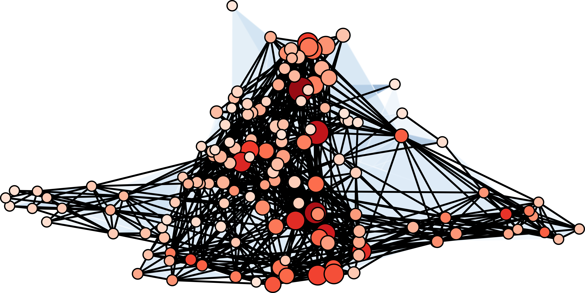
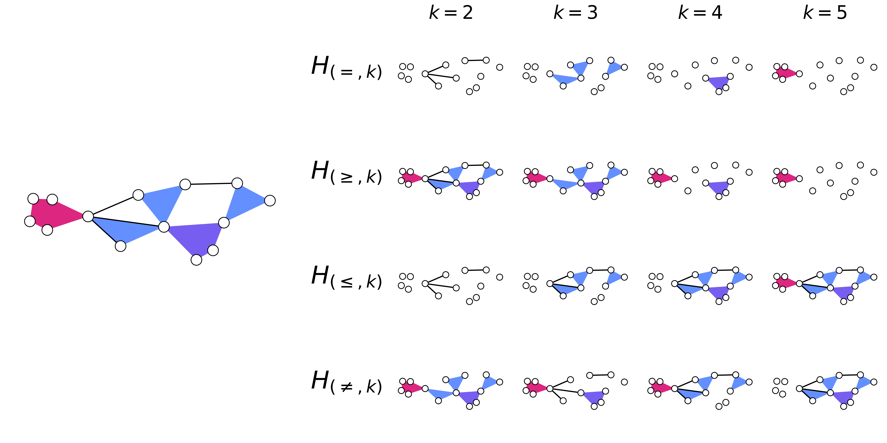

:orphan:

*******
Gallery
*******

Here are several examples of figures made using XGI:

    
    A visualization of the email-enron dataset with hyperedges of sizes 2 and 3 (all isolated nodes removed). The nodes are colored by their degree and their size proportional to the Clique motif Eigenvector Centrality. (Fig. 2 in `XGI: A Python package for higher-order interaction networks <https://doi.org/10.21105/joss.05162>`_)

.. figure:: assets/images/Simpliciality_2023_Fig3.png
    :width: 400
    :align: left
    :alt: Image of a hypergraph with nodes colored by their simpliciality measures.
    
    The local (A) simplicial fraction, (B) edit simpliciality, and (C) face edit simpliciality of the email-enron dataset filtered to include interactions of sizes 2 and 3. The colors of the histogram bars match the node colors on their corresponding network visualization. Nodes for which the local simpliciality is undefined are colored in grey. (Fig. 3 in `The simpliciality of higher-order networks <https://doi.org/10.1140/epjds/s13688-024-00458-1>`_)

    
    An illustration of a hypergraph with hyperedges of sizes two through five, visualized using XGI. This hypergraph is decomposed using different types of filtering (uniform, GEQ, LEQ, and exclusion) for different filtering parameters, :math:`k`. (Fig. 1 in `Filtering higher-order datasets <https://doi.org/10.1088/2632-072X/ad253a>`_)

